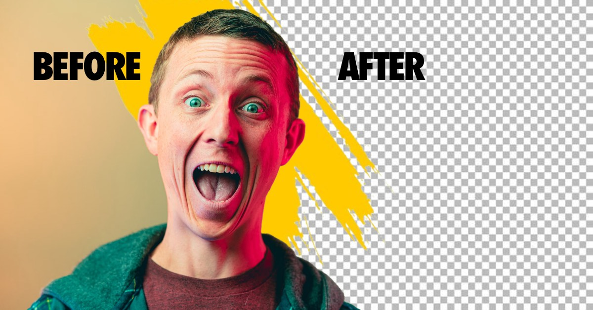

# BG Remover

A powerful React + Vite application that removes backgrounds from images directly in your browser. This app leverages machine learning models through Transformers.js to process media locally, ensuring your files never leave your device.

## 🌟 Live Demo

Experience BG Remover in action: **[🚀 Live Demo](https://bg-remover-lac.vercel.app/)**

## 📸 Screenshots


*Clean and intuitive interface for background removal*


*Example of background removal results*

## ✨ Features

### Core Functionality
- 🎯 **One-click background removal** - Remove backgrounds from images instantly
- 🎨 **Custom backgrounds** - Add solid colors, gradients, or custom images as new backgrounds
- 💾 **Multiple download formats** - Save as PNG with transparency or with custom backgrounds
- 📱 **Responsive design** - Works seamlessly on desktop, tablet, and mobile devices
- 🖼️ **Image gallery** - View and manage your processed images with history
- ✏️ **Edit functionality** - Re-edit previously processed images
- 🔍 **Search and filter** - Find images by date or search through your gallery

### Privacy & Performance
- 🏃‍♂️ **Local processing** - No server uploads needed, everything runs in your browser
- 🔒 **Privacy-focused** - Your images never leave your device
- ⚡ **WebGPU acceleration** - Optional GPU acceleration for supported browsers
- 💾 **Offline capable** - Works without internet connection after initial load
- 🗄️ **Local storage** - Images stored locally using IndexedDB

### User Experience
- 🎭 **Intuitive interface** - Clean, modern design with smooth animations
- 🌙 **Dark/Light themes** - Comfortable viewing in any lighting condition
- 📋 **Drag & drop** - Easy file upload with drag and drop support
- ⚡ **Fast processing** - Optimized for quick background removal
- 🔄 **Batch processing** - Process multiple images efficiently

### 🚀 Advanced Job Management
- 📊 **Real-time progress tracking** - Live progress bars with detailed status updates
- 🔄 **Background job processing** - Continue using the app while images process
- 📦 **Smart batch grouping** - Automatic session management and batch organization
- 🔔 **Intelligent notifications** - Browser and in-app notifications for job completion
- 📋 **Comprehensive job queue** - Dedicated interface for managing all processing jobs
- ⏱️ **Time estimation** - Accurate remaining time predictions for active jobs
- 🎯 **Job controls** - Cancel, retry, and monitor individual jobs or entire batches

## Technical Implementation

The app implements a cross-browser approach to background removal with optional WebGPU acceleration:

### Default Implementation (All Browsers)
- Uses [RMBG-1.4](https://huggingface.co/briaai/RMBG-1.4), a robust background removal model
- Ensures consistent performance across all modern browsers
- Processes images efficiently using WebAssembly

### Optional WebGPU Acceleration
- For browsers with WebGPU support, offers [MODNet](https://huggingface.co/Xenova/modnet) as an alternative
- Can be enabled through a dropdown when WebGPU is available
- Leverages GPU acceleration for potentially faster processing

Both implementations use Transformers.js to run the machine learning models directly in the browser, eliminating the need for server-side processing.

## How It Works

1. **File Selection**: Upload any image file
2. **Model Selection**: 
   - By default, uses RMBG-1.4 for maximum compatibility
   - If WebGPU is available, offers option to switch to MODNet
3. **Background Removal**: The selected ML model processes your media, creating an alpha mask
4. **Customization**: Choose a custom background color, image or keep transparency
5. **Export**: Download your processed media with either transparent or colored background

## 🚀 Getting Started

### Prerequisites
- Node.js (version 16 or higher)
- npm or yarn package manager
- Modern web browser (Chrome, Firefox, Safari, Edge)

### Installation

1. **Clone the repository:**
```bash
git clone https://github.com/Benighter/Image-bg-remover.git
cd Image-bg-remover
```

2. **Install dependencies:**
```bash
npm install
```

3. **Start the development server:**
```bash
npm run dev
```

4. **Open your browser:**
Navigate to `http://localhost:5173` to start using BG Remover

### Building for Production

```bash
# Build the application
npm run build

# Preview the production build
npm run preview
```

### Deployment

The app can be easily deployed to various platforms:

- **Vercel**: Connect your GitHub repository for automatic deployments
- **Netlify**: Drag and drop the `dist` folder after building
- **GitHub Pages**: Use GitHub Actions for automated deployment
- **Any static hosting**: Upload the contents of the `dist` folder

## 🌐 Browser Support

| Browser | Default Support | WebGPU Support |
|---------|----------------|----------------|
| Chrome | ✅ Full | ✅ Available |
| Firefox | ✅ Full | ⏳ Coming Soon |
| Safari | ✅ Full | ⏳ Coming Soon |
| Edge | ✅ Full | ✅ Available |

**Note**: WebGPU provides faster processing but is optional. The app works perfectly with the default RMBG-1.4 model in all browsers.

## 🛠️ Technical Stack

### Frontend
- **React 18** - Modern React with hooks and concurrent features
- **Vite** - Fast build tool and development server
- **TailwindCSS** - Utility-first CSS framework for styling
- **React Dropzone** - Drag and drop file upload functionality

### Machine Learning
- **Transformers.js** - Run ML models directly in the browser
- **RMBG-1.4** - Primary background removal model (cross-browser)
- **MODNet** - Alternative model with WebGPU acceleration
- **ONNX Runtime Web** - Optimized model inference

### Storage & Performance
- **IndexedDB** - Browser-based database for image storage
- **Dexie.js** - Modern wrapper for IndexedDB
- **WebGPU** - Optional GPU acceleration for supported browsers
- **Web Workers** - Background processing for better performance

## 📁 Project Structure

```
bg-remove/
├── public/                 # Static assets
├── src/
│   ├── components/        # React components
│   ├── hooks/            # Custom React hooks
│   ├── lib/              # Utility libraries
│   ├── styles/           # CSS and styling
│   └── App.jsx           # Main application component
├── package.json          # Dependencies and scripts
├── vite.config.js        # Vite configuration
└── tailwind.config.js    # TailwindCSS configuration
```

## 🤝 Contributing

Contributions are welcome! Please feel free to submit a Pull Request. For major changes, please open an issue first to discuss what you would like to change.

### Development Guidelines
1. Fork the repository
2. Create a feature branch (`git checkout -b feature/amazing-feature`)
3. Commit your changes (`git commit -m 'Add some amazing feature'`)
4. Push to the branch (`git push origin feature/amazing-feature`)
5. Open a Pull Request

## 📝 License

This project is licensed under the MIT License - see the [LICENSE.md](LICENSE.md) file for details.

## 🙏 Acknowledgments

- Originally based on the [WebGPU background removal demo](https://github.com/huggingface/transformers.js-examples/tree/main/remove-background-webgpu) by [@xenova](https://github.com/xenova)
- Enhanced by [Addy Osmani](https://github.com/addyosmani)
- RMBG-1.4 model by [BRIA AI](https://huggingface.co/briaai/RMBG-1.4)
- MODNet model by [Hugging Face](https://huggingface.co/Xenova/modnet)

## 📞 Support

If you encounter any issues or have questions:
1. Check the [Issues](https://github.com/Benighter/Image-bg-remover/issues) page
2. Create a new issue if your problem isn't already reported
3. Provide detailed information about your browser and the issue

---

**Made with ❤️ using React and modern web technologies**
